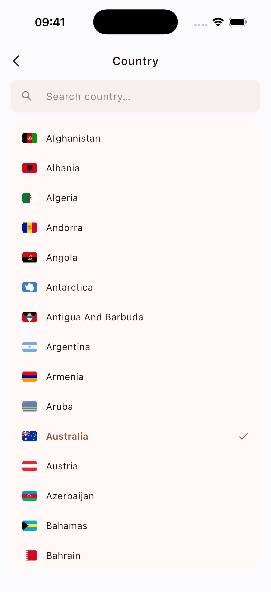
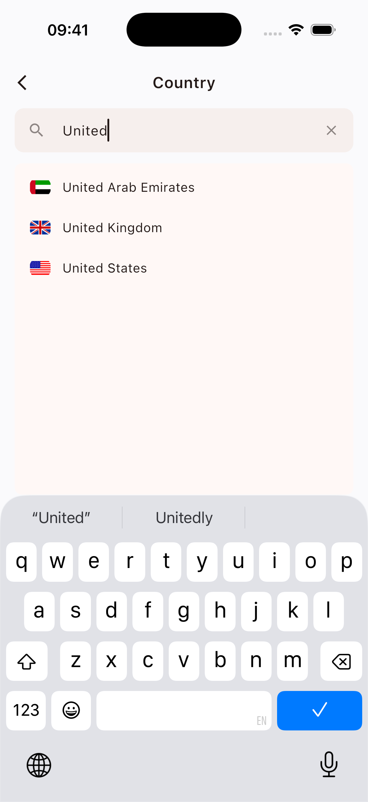

# local_country_picker

A self-contained country picker for Flutter. 205 countries, flag images
bundled in two shapes (rounded **and** rectangular), translations for
English and Dutch, theme-aware colors that fall back to your `ThemeData`.
**No network calls** — everything is local.

| Country list | Search filter |
| --- | --- |
|  |  |

## Install

```yaml
dependencies:
  local_country_picker: ^0.1.0
```

## Usage

```dart
import 'package:local_country_picker/local_country_picker.dart';

final result = await showCountryPicker(
  context,
  selected: const Country(alpha2: 'NL'),
  shape: CountryFlagShape.round,
);

if (result != null) {
  // result.alpha2 == 'NL', 'US', ...
  final name = countryNameOf(context, result.alpha2);
  print('${result.alpha2} — $name');
}
```

### Returned object

```dart
class Country {
  final String alpha2; // ISO 3166-1 alpha-2 ('NL', 'US', ...)
}
```

Display names are looked up at render time (so they track locale changes
correctly), via:

- `countryNameOf(context, code)` — sync, in widget code, requires the
  delegate registered (see [Localizations](#localizations) below).
- `countryNameFor(code, {locale})` — async, anywhere.

### Flag shape

```dart
CountryFlagShape.round  // default — circular flags (24×24)
CountryFlagShape.rect   // rectangular flags
```

### Theme

Every color and the font family are taken from `Theme.of(context)` by
default. Override any subset:

```dart
showCountryPicker(
  context,
  theme: const CountryPickerTheme(
    selectedColor: Color(0xFFFF4500),
  ),
);
```

| Field                  | Default                                          |
| ---------------------- | ------------------------------------------------ |
| `backgroundColor`      | `theme.scaffoldBackgroundColor`                  |
| `surfaceColor`         | `colorScheme.surface`                            |
| `selectedColor`        | `colorScheme.primary`                            |
| `onSurfaceColor`       | `colorScheme.onSurface`                          |
| `iconColor`            | `colorScheme.onSurface`                          |
| `searchFieldFillColor` | `surface` tinted slightly toward `onSurface`     |
| `hintColor`            | `colorScheme.onSurface` @ 50%                    |

### Localizations

For instant load (no spinner on picker open), register the delegate in
your `MaterialApp`:

```dart
MaterialApp(
  localizationsDelegates: const [
    CountryPickerLocalizations.delegate,
    GlobalMaterialLocalizations.delegate,
    GlobalWidgetsLocalizations.delegate,
    GlobalCupertinoLocalizations.delegate,
  ],
  supportedLocales: CountryPickerLocalizations.supportedLocales,
)
```

Without it, `showCountryPicker` falls back to loading translations on
demand, briefly showing a spinner.

### Locale

Translations follow the ambient `Localizations` by default. Pass `locale:`
to force one:

```dart
showCountryPicker(context, locale: const Locale('nl', 'NL'));
```

Supported out of the box: `en_US`, `nl_NL`. Other locales fall back to
English.
